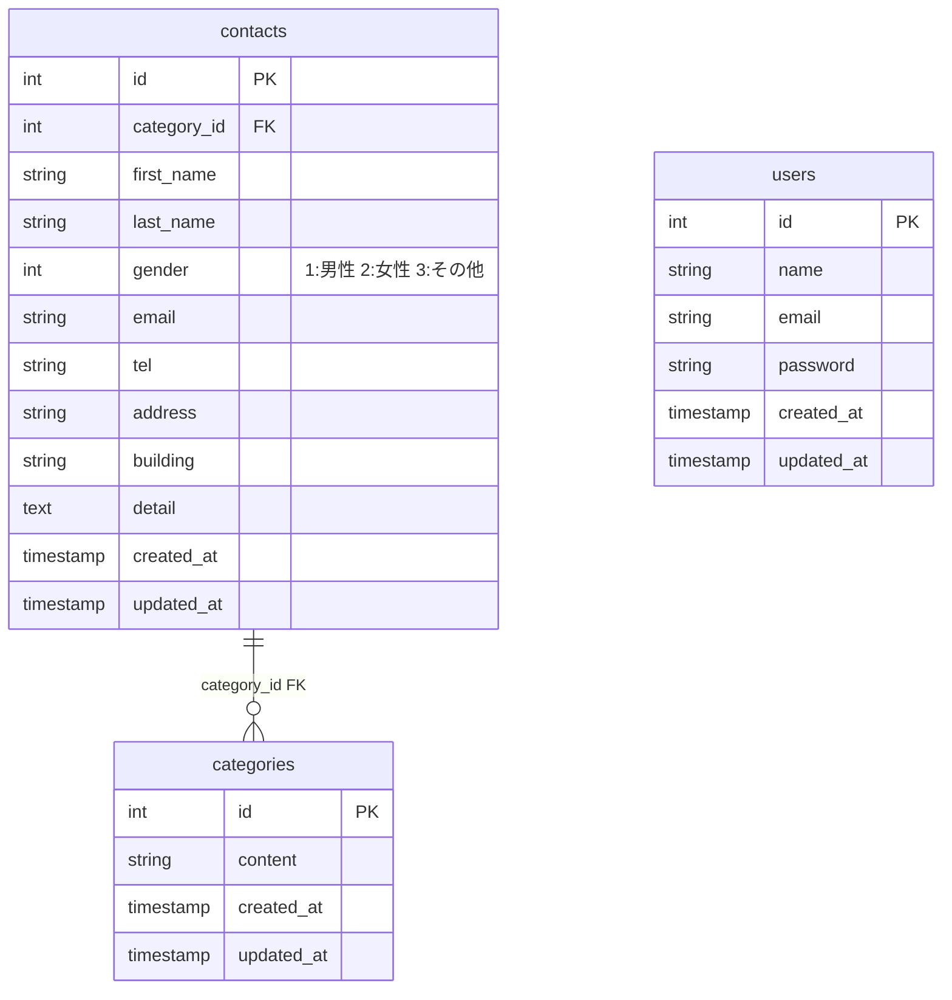

# contact-form-test

## 環境構築
** Dockerビルド **
・ git clone git@github.com:Haruna613/contact-form-test.git
・ docker-compose up -d --build

** Laravel環境構築 **
・ docker-compose exec php bash
・ composer install
・ cp .env.example .env ,  環境変数を適宜変更
・ php artisan key:generate
・ php artisan migrate
・ php artisan db:seed

** 開発環境 **
・ お問い合わせ画面 : http://localhost/
・ ユーザー登録 : http://localhost/register
・ phpMyAdmin : http://localhost:8080/

** 使用技術（実行環境） **
・ php 8.4.12
・ Laravel 8.75
・ MySQL 8.0.26
・ nginx 1.21.1

** ER図 **

