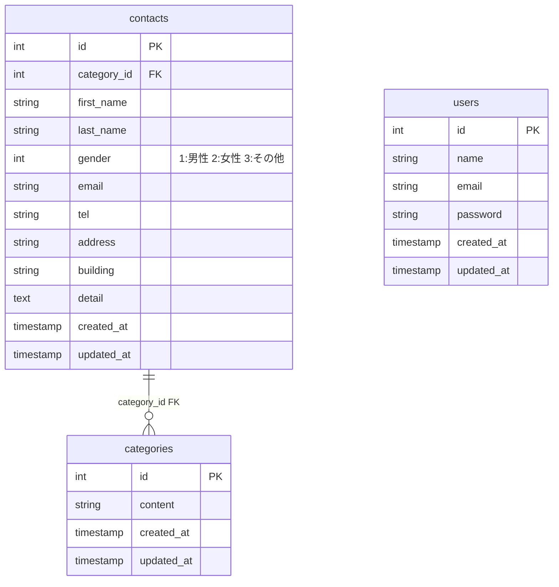

```mermaid
erDiagram
    contacts ||--o{ categories : "category_id FK"

    contacts {
        int id PK
        int category_id FK
        string first_name
        string last_name
        int gender "1:男性 2:女性 3:その他"
        string email
        string tel
        string address
        string building
        text detail
        timestamp created_at
        timestamp updated_at
    }

    categories {
        int id PK
        string content
        timestamp created_at
        timestamp updated_at
    }

    users {
        int id PK
        string name
        string email
        string password
        timestamp created_at
        timestamp updated_at
    }


```
